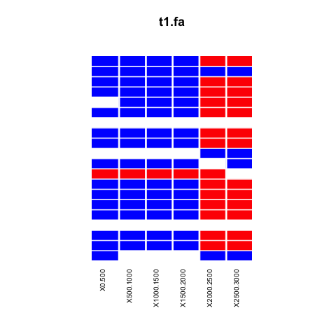

# phynd
phynd the conflict in your alignments

## General usage

The scripts here are relatively simple and easy to run. But in order to take full advantage of them, you will want to ensure that these are installed:
 - iqtree (for running the tree analyses)
 - R (for plotting)
 - ggplot within R

You can run a basic analysis with the command

`./src/phynd -s SEQFILE -w 1000 -i 1000 -t 2`
and
`./src/phynd -s SEQFILE -w 1000 -i 1000 -p -t 2`
if you want to plot. 

## Examples

